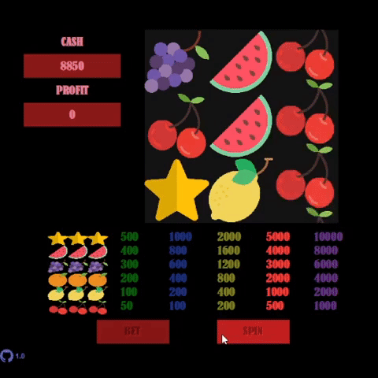

# RetroCasinoGame
---
---
## Description
Retro slot machine wins for 3 identical icons.

## Features
* **Retro Casino Game** 3 of the same picture draws a prize, the draws depend on the size of the bet.
* The game continues until the amount is 0.
* Game elements can also be modified after the fact, the values of the classes in the list package, other `images`, other `colors` can be specified,
* plus the `starting value`, `rotation speed`, the `size` of the `bet's prize`.

## Gif


## External classes
- [ResponsiveFrame](https://github.com/MagyarZoli/ResponsiveFrame)
  - Responsive Frame follows the size changes of the window, and the added Components also follow the size changes, but it can also be specified in the traditional version.
- [ComponentsArray](https://github.com/MagyarZoli/ComponentsArray)
  - Creating an array of the specified class. The contents of the array are filled with the type of the specified class.
- ColorList
  - The color list contains the foreground and background colors of the specified components, the program does not modify the colors. Contains arrays based on which I can request the colors of the components.
- ImageList
  - Class for storing images. Load images from the `./image` folder. The images are of `png` type.

## Example
There are many other possible outcomes during program execution.
``` java
    @Override
    public void actionPerformed(ActionEvent e) {
        if(e.getSource()==buttons[1] && !foundWinner){
            spinCost();
            gameLaunch();
            gameOverQuestion();
        }
        else if(e.getSource()==buttons[1] && foundWinner){
            redeemingPrize();
            costChange();
        }
        if(e.getSource()==buttons[0]){
            betChange();
            costChange();
        }
        if(e.getSource()==github){
            try {
                Desktop.getDesktop().browse(new URI(url));
            } catch (IOException | URISyntaxException e2) {
                e2.printStackTrace();
            }
        }
    }
```

Several Label classes that inherit from the JLabel class. these minds can be modded by filling them with the appropriate different elements once and for all in a method.
``` java
    private void bets(int[] array){
        for(int i=0; i<costs.length; i++){
            if(i==0){
                bets[i].setActiv(true);
            }
            bets[i].setText(
                "<html>"+
                    (iconsCosts[5]*costs[i])+"<br>"+
                    (iconsCosts[4]*costs[i])+"<br>"+
                    (iconsCosts[3]*costs[i])+"<br>"+
                    (iconsCosts[2]*costs[i])+"<br>"+
                    (iconsCosts[1]*costs[i])+"<br>"+
                    (iconsCosts[0]*costs[i])+
                "</html>"
            );
            bets[i].setOpaque(false);
            bets[i].setForeground(ColorList.BETS_FOREGROUND[i]);
            bets[i].setBounds(widthArray[(array[0]+(i*2))], heightArray[array[1]], (widthArray[array[2]]-widthArray[array[3]]), (heightArray[array[4]]-heightArray[array[5]]));
            this.add(bets[i]);
            }
        }
```

When the spinning starts, it draws new images, the previous ones inherit the previous images,
when the spin is over, it is uploaded to the array for inspection.
``` java
    private void speedRotating(){
        for(int i=0; i<3; i++){
            if(speeds[i]>=paintHeight){
                speeds[i]=0;
                spins[i]-=12-(i*(i+1));
                for(int j=3; j>0; j--){
                    randomImage[j+(i*4)] = randomImage[(j-1)+(i*4)];
                }
                randomImage[(i*4)] = random.nextInt(ImageList.IMAGES.length);
                winquestion =true;
            }
            else{
                speeds[i]+=spins[i];
            }
        }
        if(winquestion && spins[2]==0){
            winQuestion();
            winquestion = false;
        }
    }
```

### Authors
Magyar Zoltán

### Contact
magyarz95@gmail.com